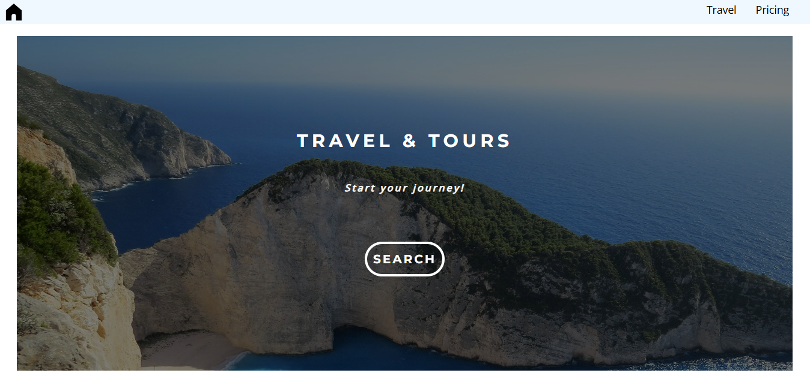

# 🌍 Travel & Tours App

A responsive React application for browsing and booking travel destinations, with interactive pricing calculation.



## ✨ Features

- **Destination Gallery**: Browse beautiful travel locations
- **Responsive Design**: Works on mobile, tablet, and desktop
- **Interactive UI**: Animated cards and hover effects
- **Video Background**: Engaging travel video section

## 🛠 Technologies Used

- React 18
- React Router 6
- Bootstrap 5
- React Icons
- React Player (for video)
- CSS3 (Flexbox/Grid)

## 🚀 Live Demo

Experience the app directly:  
👉

## 🖥️ Installation

1. Clone the repository:
   ```bash
   git clone https://github.com/yourusername/travel-tours-app.git
   ```
